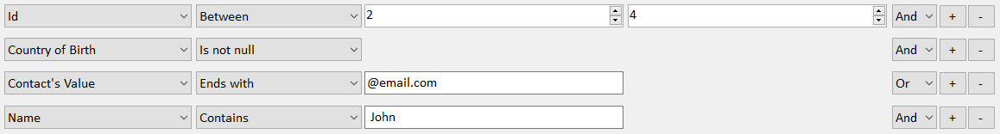

# Expression Builder
Have you ever tried to provide your users a way to dynamically build their own query to filter a list? If you ever tried, maybe you found it a bit complicated. If you never tried, believe me when I say it could be, at least, tedious to do. This project aims to give your application the ability to enable your users to create their own filters to query lists or even databases. If you would like more details on how it works, please, check out the article [Build Lambda Expression Dinamically](https://www.codeproject.com/Articles/1079028/Build-Lambda-Expressions-Dynamically).

# Motivation
Let us imagine we have classes like this...
```
public enum PersonGender
{
    Male,
    Female
}

public class Person
{
    public int Id { get; set; }
    public string Name { get; set; }
    public PersonGender Gender { get; set; }
    public BirthData Birth { get; set; }
    public List<Contact> Contacts { get; private set; }
    public Company Employer { get; set; }

    public class BirthData
    {
        public DateTime Date { get; set; }
        public string Country { get; set; }
    }

    public class Company {
        public string Name { get; set; }
        public string Industry { get; set; }
    }
}

public enum ContactType
{
    Telephone,
    Email
}

public class Contact
{
    public ContactType Type { get; set; }
    public string Value { get; set; }
    public string Comments { get; set; }
}
```
...and we have to build the code behind a form like this one to filter a list of Person objects:



Now, what about being able to do it in a way like this:
```
var filter = new Filter<Person>();
filter.By("Id", Operation.Between, 2, 4,  FilterStatementConnector.And);
filter.By("Contacts[Value]", Operation.EndsWith, "@email.com", default(string), FilterStatementConnector.And);
filter.By("Birth.Country", Operation.IsNotNull, default(string), default(string),  FilterStatementConnector.Or);
filter.By("Name", Operation.Contains, " John");
var people = People.Where(filter);

//or like this...

var filter = new Filter<Person>();
filter.By("Id", Operation.Between, 2, 4)
      .And.By("Birth.Country", Operation.IsNotNull)
      .And.By("Contacts[Value]", Operation.EndsWith, "@email.com")
      .Or.By("Name", Operation.Contains, " John ");
var people = People.Where(filter);
```
So that would generate an expression like this:
```
People.Where(p => (p.Id >= 2 && p.Id <= 4)
             && (p.Birth != null && p.Birth.Country != null)
             && (p.Contacts != null && p.Contacts.Any(c => c.Value.Trim().ToLower().EndsWith("@email.com")))
             || (p.Name != null  && p.Name.Trim().ToLower().Contains("john")));
```

Would this help you anyway? Well, if your answer was 'yes', then you just found the right project.

# License
Copyright 2017 David Belmont

Licensed under the Apache License, Version 2.0 (the "License");
you may not use this file except in compliance with the License.
You may obtain a copy of the License at [LICENSE](LICENSE)

Unless required by applicable law or agreed to in writing, software
distributed under the License is distributed on an "AS IS" BASIS,
WITHOUT WARRANTIES OR CONDITIONS OF ANY KIND, either express or implied.
See the License for the specific language governing permissions and
limitations under the License.

Icon by [Alina Oleynik](https://thenounproject.com/dorxela), Ukraine
